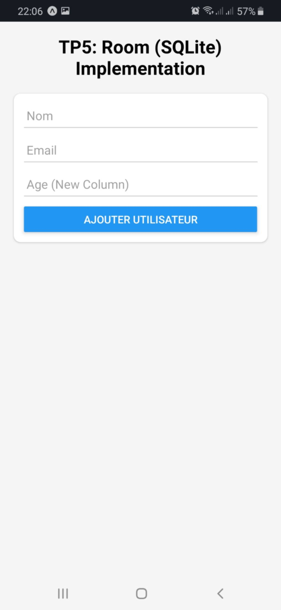
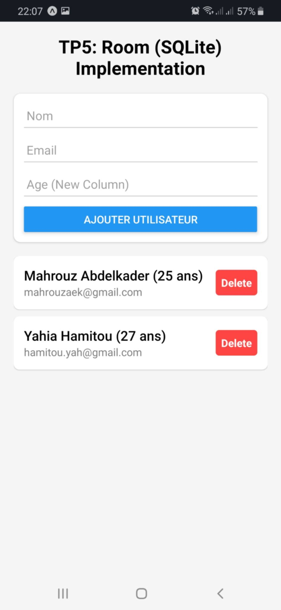
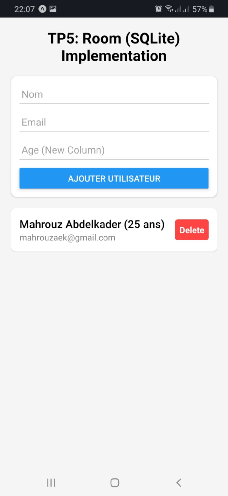
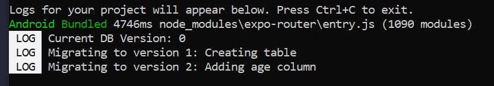

# TP5: Local Data Persistence (Android Room Adaptation)

This project is a **React Native / Expo** implementation of the "**Local Data Persistence with Room**" TP.

Due to **hardware constraints** preventing the use of **Android Studio** and the **Gradle build system**, this project adapts the core architectural concepts of the Android **Room library** (`Entities`, `DAOs`, `Migrations`) into a **JavaScript/SQLite** environment using `expo-sqlite`.

## Project Overview

The application allows users to manage a list of users (**CRUD operations**) stored **locally** on the device. It demonstrates:

-   **Local Database Storage**: Using SQLite.
-   **DAO Pattern**: Separation of SQL logic from UI code.
-   **Asynchronous Operations**: Non-blocking database calls (replacing Kotlin Coroutines).
-   **Schema Migration**: Handling database version upgrades (Version 1 → Version 2).

## Tech Stack

-   **Framework**: React Native (via Expo)
-   **Database**: SQLite (expo-sqlite)
-   **Routing**: Expo Router
-   **Language**: JavaScript (ES6+)

## Architectural Mapping (Android vs. React Native)

To satisfy the TP requirements, We have mapped the Android Room components to their React Native equivalents:

| Concept               | Android Room (Original TP)    | React Native Implementation        |
| --------------------- | ----------------------------- | ---------------------------------- |
| **ORM**               | Room Library                  | `expo-sqlite` (Direct SQL)         |
| **Schema Definition** | `@Entity` Data Class          | `CREATE TABLE` SQL execution       |
| **Data Access**       | `@Dao` Interface              | `UtilisateurDao` Object            |
| **Connection**        | `RoomDatabase` Singleton      | `AppDatabase.js` Singleton Pattern |
| **Async Handling**    | Kotlin Coroutines (`suspend`) | JavaScript `async` / `await`       |
| **Migration**         | `Migration` Class             | Manual `PRAGMA user_version` logic |

## Installation & Running

1. **Prerequisites**:

    - Node.js installed.
    - Expo Go app installed on your physical Android device.

2. **Install Dependencies**:

```shell
npm install
```

3. **Start the Server**:

```shell
npm expo start
```

4. **Run on Device**:
    - Scan the **QR code** displayed in the **terminal** using the **Expo Go app** on your **Android phone**.

## Features & Verification

1. **Database Initialization**

On the first launch, the app creates the database `base_donnees_app.db` and the `utilisateurs` table.

2. **CRUD Operations**

-   **Create**: Enter Name, Email, and Age to add a user.
-   **Read**: The list updates automatically upon entry.
-   **Delete**: Tap the "Delete" button to remove a user.

3. **Database Migration**

The TP required adding an `age` column in Version 2. This is handled in `AppDatabase.js`.

**To verify the migration works**:

1. Run the app.
2. Check the terminal/console logs. You will see the version tracking logic:

```
Current DB Version: 0
Migrating to version 1: Creating table
Migrating to version 2: Adding age column
```

On subsequent runs, it will detect `Current DB Version: 2` and skip migration, ensuring data persistence.

## Screenshots

| Home Screen                                                          | Add User                                                             | Delete User                                                          | Migration                                                            |
|----------------------------------------------------------------------|----------------------------------------------------------------------|----------------------------------------------------------------------|----------------------------------------------------------------------|
|  |  |  |  |

## Project Structure

```
.
├── README.md
├── app
│   └── index.jsx
├── app.json
├── assets
│   ├── adaptive-icon.png
│   ├── favicon.png
│   ├── icon.png
│   └── splash-icon.png
├── database
│   ├── AppDatabase.js # Database Config & Migration Logic
│   └── UtilisateurDao.js # Data Access Object (SQL Queries)
├── package-lock.json
└── package.json
```
